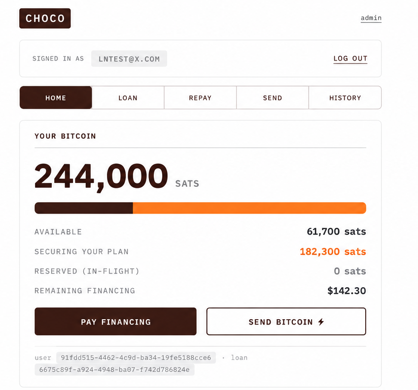

# Choco Platform Specification

<table>
  <tr>
    <td valign="top" width="72%">
      <table>
        <tr>
          <th align="left">Field</th>
          <th align="left">Value</th>
        </tr>
        <tr>
          <td><strong>Status</strong></td>
          <td>Draft</td>
        </tr>
        <tr>
          <td><strong>Audience</strong></td>
          <td>Product, engineering, capital partners, and operators</td>
        </tr>
        <tr>
          <td><strong>Scope</strong></td>
          <td>High-level platform behavior, not implementation detail</td>
        </tr>
      </table>
    </td>
    <td align="right" valign="top" width="28%">
      
    </td>
  </tr>
</table>

Choco is a financing platform for acquiring Bitcoin with a small down payment
and repaying the financed balance over time. The client receives economic
ownership of the full Bitcoin position at funding, while Choco holds part of the
position as collateral and releases it progressively as principal is repaid.

The platform is designed around a simple promise:

> Buy more Bitcoin today. Repay over time. Unlock more of your Bitcoin as you
> pay.

This specification describes the product model and operating boundaries. It is
intentionally independent of any single codebase, custodian, Lightning provider,
or deployment environment.

---

## 1. Product Model

Choco offers a starter financing product with fixed terms selected by the
platform, not negotiated by the client at checkout. A client contributes a down
payment, Choco finances the remaining principal, and the combined amount is used
to acquire Bitcoin at funding.

The acquired Bitcoin is split into three conceptual buckets:

| Bucket | Purpose |
| --- | --- |
| **Immediate** | A small amount available at funding so the client can see and use part of the position immediately. |
| **Locked equity** | The client's first-loss contribution, held until full payoff. |
| **Locked financed balance** | The financed portion, released gradually as principal is repaid. |

The exact product amounts, APR, term, grace period, and tranche percentages are
platform policy. They may change by product version without changing the core
platform model.

---

## 2. Core Experience

From the client's perspective, Choco should feel like a simple Bitcoin purchase
with a repayment plan:

1. The client requests the starter product.
2. Choco approves and funds the position.
3. The client sees their total owned Bitcoin, the portion currently available,
   and the portion still locked.
4. Each payment is applied first to interest owed and then to principal.
5. Principal repayment unlocks more Bitcoin.
6. Full payoff unlocks the entire remaining position.
7. Available Bitcoin can be withdrawn or spent through supported payment rails.

The product should avoid exposing clients to trading, margin, liquidation,
wallet infrastructure, or custody mechanics. Those are platform concerns.

---

## 3. Roles

| Role | Responsibility |
| --- | --- |
| **Client** | Requests financing, makes payments, owns the economic upside of the Bitcoin position, and may withdraw available Bitcoin. |
| **Choco** | Funds approved positions, maintains the system of record, services repayments, controls operational liquidity, and manages reserves. |
| **Admin** | Approves, rejects, reviews, and defaults loans; manages operational wallet settings and reserve visibility. |
| **Agent** | Records verified repayments on Choco's behalf, such as in-person or assisted collections. |
| **Payment rail** | Provides outbound Bitcoin or Lightning-style payment capability. |
| **Price source** | Provides the executable Bitcoin acquisition price at funding. |

Clients do not self-report repayments. A payment becomes effective only when
Choco or an authorized agent records that value has been received.

---

## 4. Position Accounting

Each client has a Bitcoin position tracked in integer satoshis:

```text
owned = available + locked + reserved
```

<table>
  <tr>
    <td valign="top" width="52%">
      <table>
        <thead>
          <tr>
            <th align="left">Balance</th>
            <th align="left">Meaning</th>
          </tr>
        </thead>
        <tbody>
          <tr>
            <td><strong>Owned</strong></td>
            <td>The client's total economic Bitcoin position.</td>
          </tr>
          <tr>
            <td><strong>Available</strong></td>
            <td>Bitcoin the client can withdraw or spend.</td>
          </tr>
          <tr>
            <td><strong>Locked</strong></td>
            <td>Bitcoin held as collateral until repayment milestones are met.</td>
          </tr>
          <tr>
            <td><strong>Reserved</strong></td>
            <td>Available Bitcoin temporarily held for an in-flight withdrawal or payment.</td>
          </tr>
        </tbody>
      </table>
    </td>
    <td valign="top" width="48%">
      
    </td>
  </tr>
</table>

This position ledger is the client-facing source of truth. External wallet
balances, payment provider state, and operational liquidity never replace it.

The platform should maintain an append-only audit ledger behind these balances.
Corrections are recorded as new entries instead of rewriting history, and
externally-triggered events should be safe to process more than once.

---

## 5. Funding

Funding is a controlled platform action. A requested loan does not buy Bitcoin
or create a client position until Choco approves and funds it.

At funding, Choco:

1. executes or records the Bitcoin acquisition;
2. fixes the exact amount of Bitcoin acquired;
3. records the product terms and funding timestamp;
4. divides the position into immediate, locked equity, and locked financed
   buckets;
5. activates the repayment schedule;
6. posts the position and loan entries to the platform ledger.

The acquisition price is used once, at funding. After that, the client's
position is denominated in satoshis, not continuously re-priced for unlocks,
delinquency, or payoff.

---

## 6. Repayment And Unlocking

Payments are applied in a consistent order:

1. interest owed;
2. principal outstanding.

Only principal repayment unlocks Bitcoin. Interest is the cost of financing and
does not release collateral.

As principal is repaid, the financed locked bucket is released proportionally
into the available balance. When the financed principal reaches zero, every
remaining locked satoshi is released, including the client's locked equity.

Clients may pay early. A full early payoff should unlock the full remaining
position and should not charge unearned future interest or impose a prepayment
penalty.

---

## 7. Delinquency And Default

Delinquency is derived from the repayment schedule. It describes how late a
client is relative to expected payments.

Default is different: it is an explicit platform decision. Choco may declare a
loan defaulted after operational review, but default does not automatically sell
Bitcoin, trigger a margin call, or liquidate a client position.

The platform is intentionally not a margin system. It does not depend on ongoing
price triggers, forced liquidation, or automatic collateral sales.

---

## 8. Payments And Withdrawals

The platform supports client withdrawals or outbound payments only from the
available balance. Locked Bitcoin is never spendable, and reserved Bitcoin
cannot be spent twice while a payment is pending.

The payment layer is abstract. A deployment may use Lightning, Spark, another
Bitcoin payment provider, or a mock provider for testing. The provider executes
payments, but Choco's ledger decides whether a client has the right to spend.

Outbound payments follow a reserve-and-settle model:

1. quote the payment and expected fee;
2. verify the client has enough available Bitcoin;
3. verify operational liquidity is enabled and sufficient;
4. reserve the payment amount and fee;
5. settle the payment when the provider confirms success or failure;
6. release unused reserves or return the full reserve on failure.

This allows the platform to support real payment rails while keeping client
ownership accounting deterministic.

---

## 9. Operational Wallet

Choco separates client ownership from operational liquidity.

The client ledger says who owns Bitcoin. The operational wallet is the working
balance used to route withdrawals and payments. It can be topped up, monitored,
and temporarily disabled without changing client ownership.

A withdrawal requires both:

1. the client has enough available Bitcoin; and
2. Choco has enough enabled operational liquidity to route the payment.

This separation makes it possible to pause outbound payments for operational
reasons without rewriting balances or changing client claims.

---

## 10. Agents And Collections

The platform allows authorized agents to record client repayments on Choco's
behalf. This supports assisted repayment flows such as field collection,
merchant-assisted payment, or cash-to-digital operations.

Agent-recorded payments may create collection float: value acknowledged to the
client before it has fully settled into Choco's own treasury process. That float
is an operational risk for Choco, not a reason to delay the client's credited
repayment once an authorized agent records it.

Agent authority, limits, audit trails, and reconciliation policy are operating
controls, not changes to the financing primitive.

---

## 11. Reserves And Proof

Choco keeps three concepts separate:

1. **Client ownership ledger**: each client's available, locked, and reserved
   Bitcoin.
2. **Operational liquidity**: the working wallet balance used to route
   withdrawals.
3. **Treasury reserves**: the actual Bitcoin backing aggregate client claims.

The platform should be able to produce a deterministic liabilities snapshot so
that total client claims can be compared against Choco's reserves. Over time,
that snapshot may support private or public proof-of-reserves workflows.

The central reserve promise is:

```text
sum(client Bitcoin claims) <= Choco Bitcoin reserves
```

---

## 12. Platform Boundaries

Choco's platform model supports:

- a fixed starter financing product;
- admin-controlled approval and funding;
- assisted repayment recording through authorized agents;
- append-only ledger accounting;
- interest-first repayment allocation;
- progressive Bitcoin unlocking as principal is repaid;
- early payoff with full unlock;
- client withdrawals from available Bitcoin;
- payment-provider abstraction for Lightning or Spark-style rails;
- operational wallet controls;
- reserve visibility and liabilities snapshots.

The platform intentionally avoids:

- margin calls;
- automatic liquidation;
- ongoing price-oracle dependency after funding;
- client-selected leverage;
- order books or trading;
- dynamic credit scoring in the starter product;
- per-client node management as a product requirement;
- treating payment-provider balances as the client ledger.

---

## 13. Reference Product

A reference starter product may use a small down payment, a larger financed
principal, a short fixed term, a fixed APR, a small day-one release, and a
locked first-loss equity tranche. Those values are illustrative product policy,
not protocol requirements.

The important properties are:

- the client owns the acquired Bitcoin exposure from funding;
- Choco's advance is secured by locked Bitcoin;
- some client-visible value can be available early for activation;
- principal repayment releases Bitcoin;
- interest never releases Bitcoin;
- payoff releases everything remaining.

---

## 14. Success Criteria

The platform is working when:

- clients understand how much Bitcoin they own, how much is available, and what
  unlocks next;
- Choco can fund, service, and reconcile the product without manual ledger
  corrections;
- repayments cannot unlock more Bitcoin than the client has earned through
  principal reduction;
- outbound payments cannot spend locked or already-reserved Bitcoin;
- operators can pause withdrawals without changing client ownership;
- liabilities can be summarized against reserves;
- the product remains understandable without teaching clients custody or
  Lightning infrastructure.

---

## 15. Glossary

| Term | Meaning |
| --- | --- |
| **Available Bitcoin** | The portion of a client's position that can be withdrawn or spent. |
| **Locked Bitcoin** | The portion held as collateral until repayment milestones are met. |
| **Reserved Bitcoin** | Available Bitcoin temporarily held for a pending outbound payment. |
| **Progressive release** | The process of moving Bitcoin from locked to available as principal is repaid. |
| **Locked equity** | The client's own contribution held as first-loss protection until payoff. |
| **Operational liquidity** | Choco's working payment balance used to route withdrawals. |
| **Treasury reserves** | Choco's actual Bitcoin backing aggregate client claims. |
| **Agent** | An authorized party that records verified repayments on Choco's behalf. |
| **Default** | A platform-declared loan state after review, not an automatic liquidation event. |
